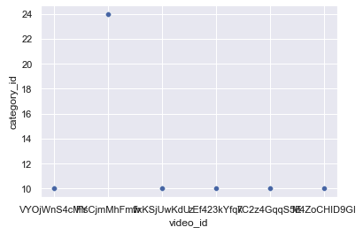

# Trending-Youtube-Videos-Analysis

## Summary
Trending Youtube Video Statistics: https://www.kaggle.com/datasets/datasnaek/youtube-new?select=CAvideos.csv
The dataset includes popular youtube video information in different regions over a period of time. 
In this project, I used data in North America, and try to classify videos according to comments and information through machine learning in python. I will develop a function for the user to use. At the same time, I will create a webpage to describe my project process and examples of using my function.

## Data Visualization
### 1. Top 30 videos with popular video ids in North America

30 videos with the highest views among the data, and show detailed data of each video. As you can see, many of the trending videos come from the same id.

### 2. Trending video IDs vs Number of Views

These two bar charts help us to compare the views/likes of these 30 videos more intuitively. Four outliers are different from the normal trend. It's worth looking at the specific video content and studying the reasons behind it.

### 3. What kind of content are the accounts producing?

Continuing to create videos with a certain category can help the video channel be more popular.

### 4. correlation chart

I selected important numerical variables such as Likes, Comment Counts, Dislikes, Views, and converted category IDs, and checked the correlation between these variables. According to the graph, we can see that these variables are all positively correlated.

## Prediction

### 
In order to help content creators evaluate the performance of their videos, I created a function that predicts comment counts for being a trending video according to other metrics. The creator can compare the real data with the predicted comment count as one of the ways to optimize future video performance and user engagement.